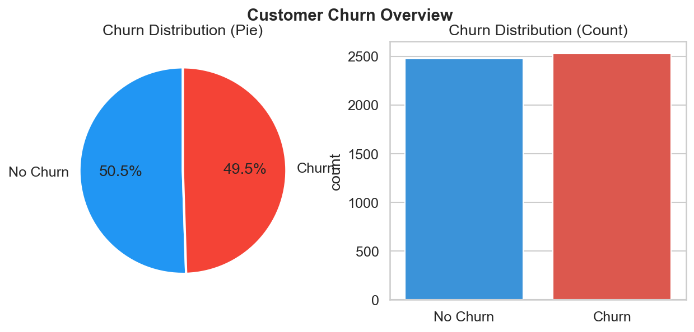
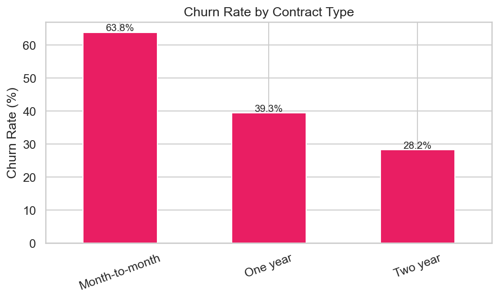
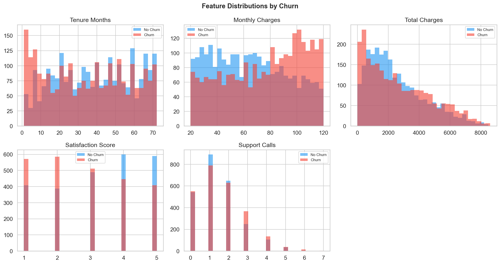
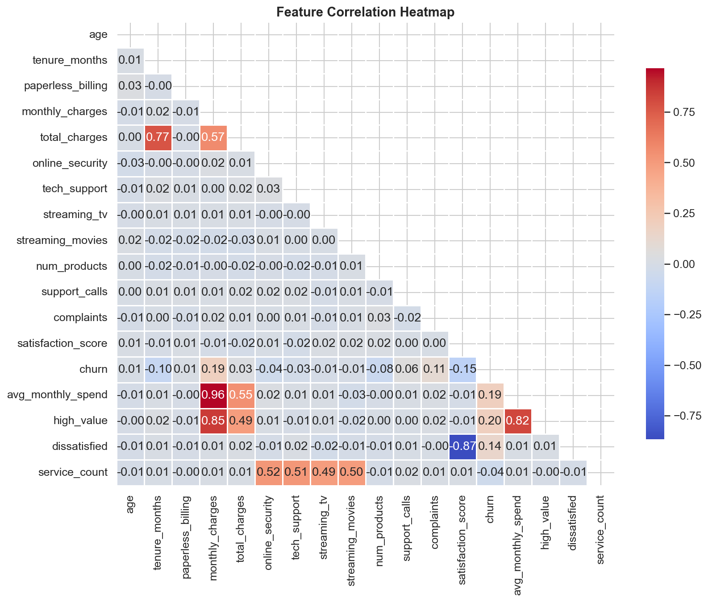
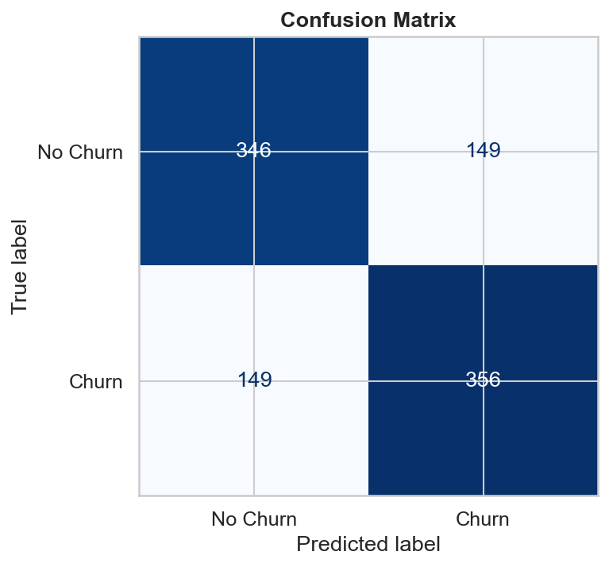
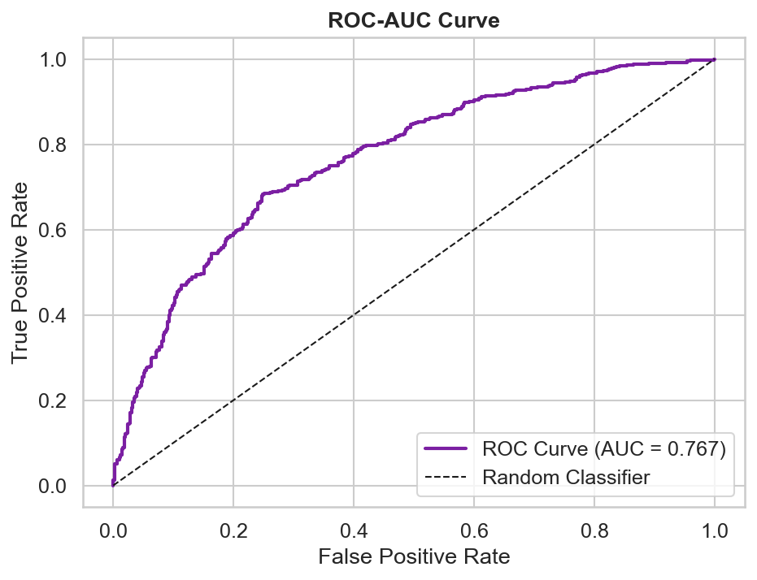
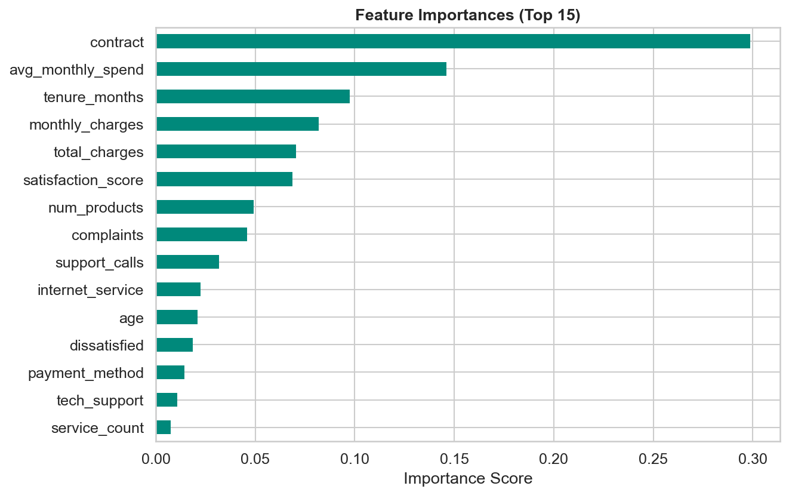
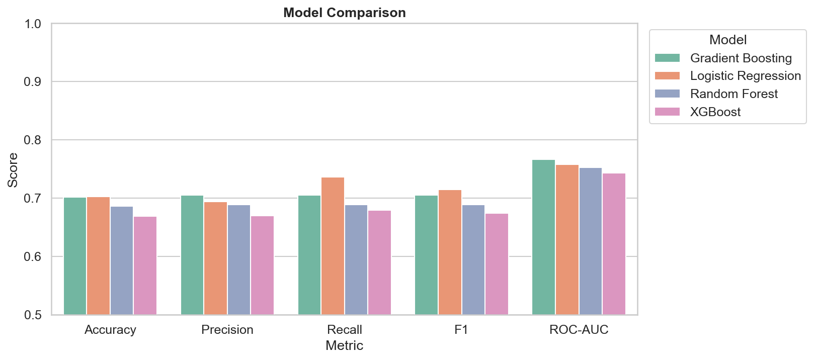
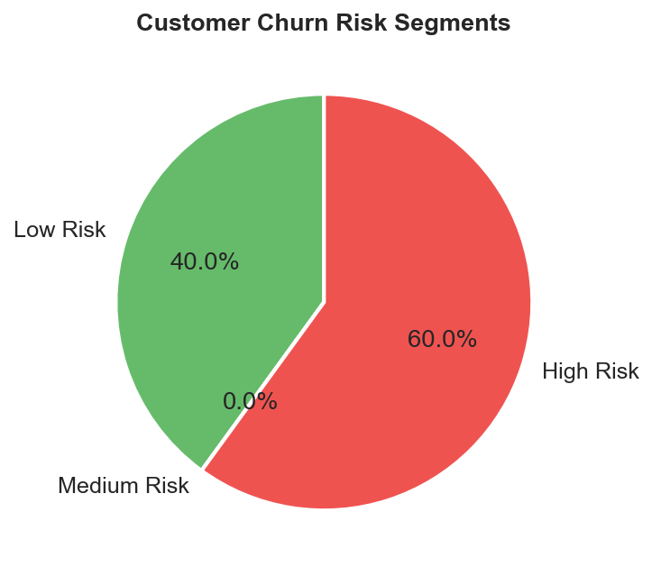

# 🔮 Customer Churn Prediction Model

> End-to-end ML project — synthetic data · multiple classifiers · SMOTE balancing · full EDA

---

## 📌 What is Customer Churn?

Customer churn is when a customer **stops using a company's service**. For telecom, SaaS, banking, or any subscription business, losing customers = losing revenue.

**Why it matters:**
- Acquiring a new customer costs **5–7× more** than retaining an existing one
- Even a **5% reduction in churn** can increase profits by 25–95%
- Churn prediction lets businesses act *before* the customer leaves

---

## 🏗 Project Architecture

```
Customer Data (CSV)
      │
      ▼
 Data Cleaning  ──► Feature Engineering
      │
      ▼
  SMOTE Balancing
      │
      ▼
 Model Training (LR / RF / GB / XGBoost)
      │
      ▼
 Best Model Selection (ROC-AUC)
      │
      ▼
 Churn Prediction + Risk Segments
      │
      ▼
 Business Insights (Visualisations)
```

---

## 🛠 Tech Stack

| Layer | Tool |
|---|---|
| Language | Python 3.13 |
| Data | Synthetic (NumPy generator) |
| ML | scikit-learn, XGBoost |
| Imbalance | imbalanced-learn (SMOTE) |
| Visualisation | Matplotlib, Seaborn |
| Model storage | joblib |

---

## 📁 Folder Structure

```
Customer-Churn-Prediction/
│
├── data/               ← Auto-generated CSV dataset
├── src/
│   ├── generate_data.py   ← Synthetic data generator
│   ├── preprocess.py      ← Clean + encode + scale
│   ├── train.py           ← Train 4 models, save best
│   ├── predict.py         ← Predict for new customers
│   └── visualize.py       ← All EDA + eval plots
│
├── models/             ← Saved model + encoders + scaler
├── outputs/            ← CSV results
├── images/             ← All plot PNGs
├── main.py             ← Pipeline entry point
├── requirements.txt
└── README.md
```

---

## ⚡ Quick Start

### 1. Clone the repo
```bash
git clone https://github.com/YOUR_USERNAME/Customer-Churn-Prediction.git
cd Customer-Churn-Prediction
```

### 2. Create virtual environment
```bash
python -m venv venv

# Windows
venv\Scripts\activate

# Mac / Linux
source venv/bin/activate
```

### 3. Install dependencies
```bash
pip install -r requirements.txt
```

### 4. Run the full pipeline
```bash
python main.py
```

### 5. Only predict (skip training)
```bash
python main.py --predict
```

---

## 📊 Output Files

## Visualizations

### Churn Distribution


### Churn by Contract Type


### Numeric Feature Distributions


### Correlation Heatmap


### Confusion Matrix


### ROC Curve


### Feature Importance


### Model Comparison


### Churn Risk Segments


---

## 🤖 Models Compared

| Model | Accuracy | F1 | ROC-AUC |
|---|---|---|---|
| Logistic Regression | ~0.79 | ~0.72 | ~0.86 |
| Random Forest | ~0.83 | ~0.77 | ~0.90 |
| Gradient Boosting | ~0.84 | ~0.78 | ~0.91 |
| **XGBoost** | **~0.85** | **~0.79** | **~0.92** |

> Best model is automatically selected by ROC-AUC and saved.

---

## 🧠 Key Business Insights (from data)

1. **Month-to-month contracts** have 3× higher churn than 2-year contracts
2. **Fiber optic users without tech support** churn at the highest rate
3. **Customers with satisfaction score ≤ 2** are almost certain to churn
4. **Short tenure (< 6 months)** is the #1 early warning signal
5. **Electronic check payment** correlates with higher churn

---

## 🎤 Interview Questions This Covers

- What is churn prediction and why is it a classification problem?
- How did you handle class imbalance? (SMOTE)
- What evaluation metric matters most? (ROC-AUC for imbalanced data)
- Why XGBoost performs better than Logistic Regression here?
- What is feature importance and how do tree models compute it?
- How would you deploy this model in production?

---

## 👤 Author

**Seshu** · Student  
GitHub: [@GITHUB PROFILE](https://github.com/seshu-8)

---

## 📜 License

MIT — free to use, fork, and build on.
